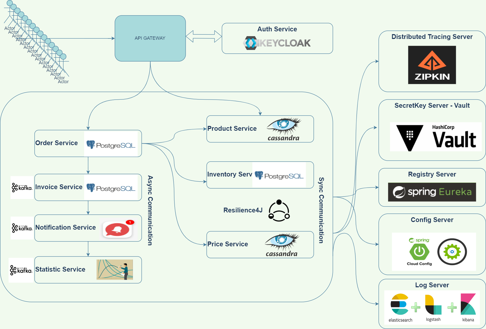
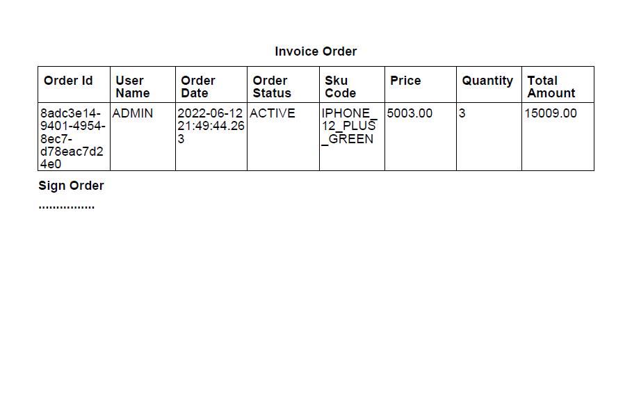
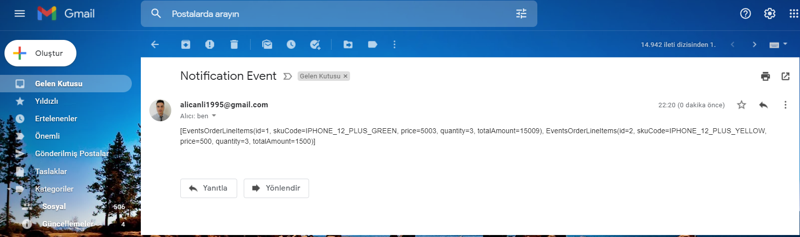

## This project is being implemented as a project that includes all the spring microservices, cloud, messaging systems that I have learned about.

## The project is under construction, it will be updated sometimes, the full documentation will be added when it is finished, the general structure and the technologies it will contain are as follows.

***Percentage of progress : 70%***

### Invoice Service Generate PDF ->  Samples Output -> 

### Mail Service Sending Basic Mail ->  Samples Output -> 

# What technologies exist ? 
    
    Integration Tests with TestContainers And JUnit 5
    Gateway Service With Spring Cloud Gateway
    Auth Server with Keycloak
    NoSQL Database ( Apache Cassandra )
    Relational Database ( PostgreSQL)
    Messaging Systems (Kafka)
    Redis Cache 
    Resilience pattern with Resilience4J 
    Eureka registry service
    Config server with git repository
    Vault server for store secret informations
    Zipkin for distributed tracing
    ELK (Elasticsearch , Logstash , Kibana) Stack for distributed logging
    Statistic service with Async communication -> Kafka
    Exception Handling
    Layered Architecture
    Dockerize all project ( maybe not implementing )
